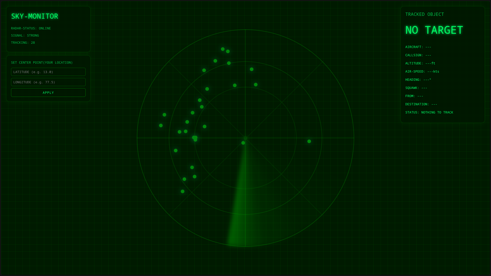

# SKY-MONITOR(Vercel Branch)

A flight tracker, which features an World_War-2 radar-like UI, built with react for frontend and fastAPI(i like it).

## Features
- Track aircrafts near you.
- Location is not collected directly, so you get privacy.[although user coords sandboxing is not implemented, so you may need to enter coords everytime it refreshes:( ]

## Stack
- React (vite) for frontend.
- Python(FastAPI) for backend.

## Setup
- Fork this repo, connect to vercel.
- Set root repo as frontend for one deployment and backend for another one.
- Check .env.example for environment variable details as frontend and backend use seperate ones.
- Turn off deployment protection if you're going to use a deifferent domain on top of vercel or if you get hit with CORS policy issues.

P.S: This set-up msg doesn't contain about how to set-up tursodb, for that please check official documentations.

## UI

## AI Usage: Nil