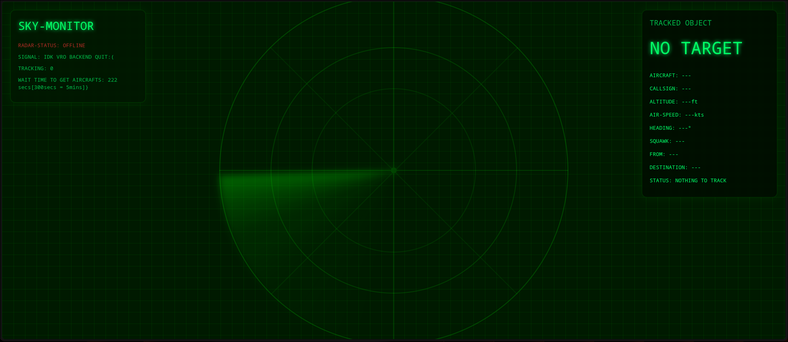
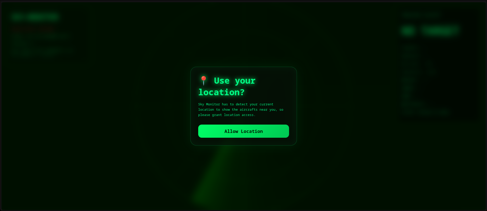

# SKY-MONITOR

A flight tracker, which features an World_War-2 radar-like UI, built with react for frontend and fastAPI(i like it).

## Features
- Track aircrafts near you.
- Location is collected directly, but its never stored and stays in the client side only.

## Stack
- React (vite) for frontend.
- Python(FastAPI) for backend.

## Setup
```bash
git clone https://github.com/s-ajay-2010/sky-monitor.git
cd sky-monitor/backend
cp .env.example .env #add your own variables to the designated variables:)
python -m venv venv
pip install -r requirements.txt
python -m uvicorn main:app --reload

#open another terminal
cd sky-monitor/frontend
cp .env.example .env #add your own variables to the designated variables:)
npm install
npm run dev
```
and then open [http://localhost:5173](http://localhost:5173)

## UI



# TO my reviewer:
- If at all any issue arises(it should not and it won't but just in case), please feel free to send me the screenshots and details on slack @ajay .
- Use a chromium based browser(brave preferable) for testing as I've found some un-explainable(yet) let lags with the requests and I'm investigating into it, so please until then do not use a firefox or firefox based browser for testing the app.
- And also please wait until [this](media/wait_timer.png) timer runs out to get requests as it'll measure for five seconds and by then you'll get the aircraft data.(P.S.: Console tab gives the aircraft list, if aircraft's blip doesn't come please check it too for empty lists, and it usually means no aircrafts is near you)


# AI Usage: Nil